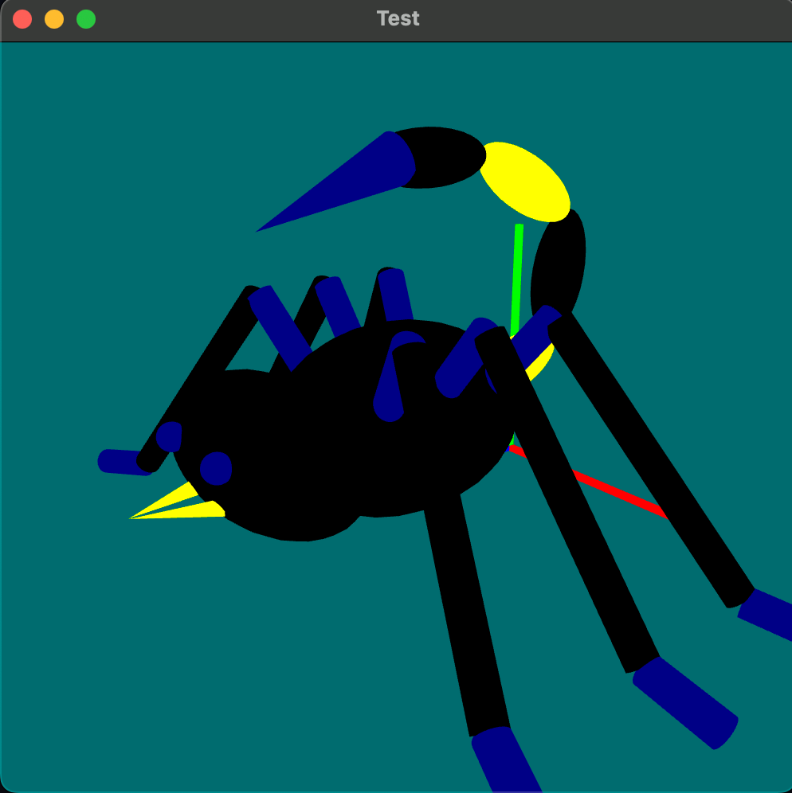

# 1. Model Definition: ModelLinkage.py


**Regardless of how complex the model is, it fundamentally consists of individual geometric shapes.** Specifically, the geometric shapes that make up the model include:

- Cone: Cone
- Cube: Cube
- Cylinder: Cylinder
- Sphere: Sphere (including ellipsoids with different radii in three directions)

All geometric shapes are defined in the `Shapes.py` file.

**The model can be further subdivided into different body structures.** Specifically:

- head: Head (including eyes and mouth)
- body: Body (including six pairs of legs)
- tail: Tail (including a needle)

All definitions of the model are in the `ModelLinkage.py` file.

**Each body structure is composed of a series of geometric shapes.** For example:

- The head consists of two cones (mouth), two spheres (eyes), and one sphere (head).
- The tail consists of four spheres (different segments of the tail) and one cone (needle).
- …

Thus, **the overall model is actually organized in a tree structure.** For example, in the following case:

- The model has a chassis (baselink) with four wheels connected to it and some other sensors.
- Therefore, the visual representation of the model is as shown in the image below, indicating that the model's tree is as depicted in the image below.


## 1. Basics

The `Component` class is the base class for model components (defined in `Component.py`), which includes a series of methods for drawing. Specifically:

- Drawing methods: These functions use OpenGL to draw the size, shape, and color of specific geometric shapes.
- Positioning methods: When the robot's position changes, it resets the robot's coordinates and redraws.
- Other methods.

This part of the methods is not our primary concern; **we only need to know how to set the position methods, as we need to set the robot's position.**

All the body parts we define need to inherit from the `Component` class.

## 2. Definition of the Spider Class

The entire robot is defined as the `Spider` class, found in the `ModelLinkage.py` file. Among these:

- head represents the head
- body represents the body
- tail represents the tail

The three parts are added to the component tree using the base class `Component`'s `addChild` method, ensuring that all three parts are automatically drawn during rendering.

Additionally, the three parts are also added to the `componentList` and `componentDict` variables for modifying the robot's posture in subsequent operations.

Each part, when instantiated, specifies its position relative to the parent component by passing a `Point` parameter. Therefore:

- The center of the body coincides with the center of the Spider.
- The center's x and y coordinates of the head match the center's x and y coordinates of the Spider, but the z coordinate is increased by the body length.
- The center's x and y coordinates of the tail match those of the Spider, but the z coordinate is decreased by the body length.

The `XXX.XRange` method is designed to set the rotation angle of a component in a specific direction, as the assignment requires not to penetrate through parts (e.g., legs penetrating into the head).

The `setDefaultAngle` method sets the initial rotation angle of a component in a specific direction.

Note that `shaderProg` is a requirement for the OpenGL drawing code; it must be passed in, but it is not our primary concern. We need to know that passing this parameter allows our model to be drawn.

```python
class Spider(Component):
    """
    Define our linkage model
    """

    components = None
    contextParent = None

    def __init__(self, parent, position, shaderProg, display_obj=None):
        super().__init__(position, display_obj)
        self.contextParent = parent

        self.initPos = position
        body = Body(self, Point((0, 0, 0)), shaderProg)
        head = Head(self, Point((0, 0, body.zSize)), shaderProg)
        tail = Tail(self, Point((0, 0, -body.zSize)), shaderProg)

        body.vRange = [-15, 15]
        body.uRange = [-10, 10]
        body.wRange = [-10, 10]

        tail.setDefaultAngle(180, tail.vAxis)
        tail.uRange = [-30, 30]
        tail.vRange = [150, 230]
        tail.wRange = [-5, 5]

        self.addChild(body)
        self.addChild(head)
        self.addChild(tail)

        self.componentList = [head, body, tail]
        self.componentDict = {"head": head, "tail": tail, "body": body}
```

## 3. Definition of the Body Class

The `Body` class is structurally similar to the `Spider` class, except that it contains six legs, which are stored using a dictionary. The initial rotation angles of the six legs are set using a loop.

Since each leg consists of three cylinders, to enhance code reusability, a separate class, `Legs`, is used to represent the legs.

The methods `reset`, `setCurrentColor`, and `resetColor` override the parent class `Component` methods, as subsequent operations require adjusting the body's color and angles using keyboard inputs. The overridden `reset` method in the `Legs` class is similarly designed.

```python
class Body(Component):
    """
    Define our linkage model
    """

    components = None
    contextParent = None

    def __init__(self, parent, position, shaderProg, display_obj=None):
        super().__init__(position, display_obj)
        self.contextParent = parent

        self.xSize = 0.7
        self.ySize = 0.7
        self.zSize = 1
        self.body = Sphere(
            Point((0, 0, 0)),
            shaderProg,
            [self.xSize, self.ySize, self.zSize],
            Ct.BLACK,
        )

        self.leftLegs: dict[str, Legs] = {
            "leftLeg1": Legs(self, Point((self.xSize, 0, -0.5)), shaderProg),
            "leftLeg2": Legs(self, Point((self.xSize, 0, 0.0)), shaderProg),
            "leftLeg3": Legs(self, Point((self.xSize, 0, 0.5)), shaderProg),
        }

        for leg, offset in zip(self.leftLegs.values(), [20, 0, -20]):
            leg.setDefaultAngle(90 + offset, leg.vAxis)

        self.rightLegs: dict[str, Legs] = {
            "rightLeg1": Legs(self, Point((-self.xSize, 0, -0.5)), shaderProg),
            "rightLeg2": Legs(self, Point((-self.xSize, 0, 0.0)), shaderProg),
            "rightLeg3": Legs(self, Point((-self.xSize, 0, 0.5)), shaderProg),
        }

        for leg, offset in zip(self.rightLegs.values(), [20, 0, -20]):
            leg.setDefaultAngle(-90 - offset, leg.vAxis)

        self.addChild(self.body)
        for component in (self.leftLegs | self.rightLegs).values():
            self.addChild(component)

        self.componentList = [
            self.body,
            *list(self.leftLegs.values()),
            *list(self.rightLegs.values()),
        ]
        self.componentDict = {
            "head": self.body,
        } | (self.leftLegs | self.rightLegs)

    def reset(self, mode="all"):
        for leg, offset in zip(self.leftLegs.values(), [20, 0, -20]):
            leg.setDefaultAngle(90 + offset, leg.vAxis)

        for leg, offset in zip(self.rightLegs.values(), [20, 0, -20]):
            leg.setDefaultAngle(-90 - offset, leg.vAxis)

        for legs in (self.leftLegs | self.rightLegs).values():
            legs.reset(mode)
        super().reset(mode)

        self.body.setCurrentColor(Ct.BLACK)

    def setCurrentColor(self, color):
        self.body.setCurrentColor(color)
        super().setCurrentColor(color)

    def resetColor(self):
        self.body.setCurrentColor(Ct.BLACK)
```

```python
class Legs(Component):
    """
    Define our linkage model
    """

    components = None
    contextParent = None

    def __init__(self, parent, position, shaderProg, display_obj=None):
        super().__init__(position, display_obj)
        self.contextParent = parent

        linkageLength = 0.5
        self.link1 = Cylinder(
            Point((0, 0, 0)),
            shaderProg,
            [0.1, 0.1, linkageLength],
            Ct.NAVY,
        )
        self.link2 = Cylinder(
            Point((0, 0, 3 * linkageLength - 0.01)),
            shaderProg,
            [0.1
```


```python
, 0.1, linkageLength * 2],
            Ct.BLACK,
        )
        self.link3 = Cylinder(
            Point((0, 0, 2.5 * linkageLength - 0.01)),
            shaderProg,
            [0.1, 0.1, linkageLength * 0.5],
            Ct.NAVY,
        )

        self.link1.setDefaultAngle(-50, self.link1.uAxis)
        self.link2.setDefaultAngle(100, self.link2.uAxis)
        self.link3.setDefaultAngle(-40, self.link3.uAxis)

        self.addChild(self.link1)
        self.link1.addChild(self.link2)
        self.link2.addChild(self.link3)

        self.componentList = [self.link1, self.link2, self.link3]
        self.componentDict = {
            "link1": self.link1,
            "link2": self.link2,
            "link3": self.link3,
        }

    def reset(self, mode="all"):
        self.link1.setDefaultAngle(-50, self.link1.uAxis)
        self.link2.setDefaultAngle(100, self.link2.uAxis)
        self.link3.setDefaultAngle(-40, self.link3.uAxis)
```

## 4. Definition of the Head Class

Similarly, the `Tooth` class is created to allow for the opening and closing of the teeth in subsequent actions.

```python
class Tooth(Component):
    """
    Define our linkage model
    """

    components = None
    contextParent = None

    def __init__(self, parent, position, size, shaderProg, display_obj=None):
        super().__init__(position, display_obj)
        self.contextParent = parent

        tooth = Cone(
            Point(position),
            shaderProg,
            size,
            Ct.YELLOW,
        )

        self.addChild(tooth)

        self.componentList = [tooth]
        self.componentDict = {"tooth": tooth}

class Head(Component):
    """
    Define our linkage model
    """

    components = None
    contextParent = None

    def __init__(self, parent, position, shaderProg, display_obj=None):
        super().__init__(position, display_obj)
        self.contextParent = parent

        self.head = Sphere(
            Point((0, 0, 0)),
            shaderProg,
            [1, 0.5, 0.5],
            Ct.BLACK,
        )

        eyeballSize = 0.1
        leftEye = Sphere(
            Point((0.3, 0.1, 0.45)),
            shaderProg,
            [eyeballSize] * 3,
            Ct.NAVY,
        )
        rightEye = Sphere(
            Point((-0.3, 0.1, 0.45)),
            shaderProg,
            [eyeballSize] * 3,
            Ct.NAVY,
        )

        self.leftTooth = Tooth(
            self,
            Point((0.1, -0.1, 0.3)),
            [0.05, 0.05, 0.25],
            shaderProg,
        )

        self.leftTooth.setDefaultAngle(-20, self.leftTooth.vAxis)

        self.rightTooth = Tooth(
            self,
            Point((-0.1, -0.1, 0.3)),
            [0.05, 0.05, 0.25],
            shaderProg,
        )
        self.rightTooth.setDefaultAngle(20, self.rightTooth.vAxis)

        self.addChild(self.head)
        self.head.addChild(leftEye)
        self.head.addChild(rightEye)
        self.head.addChild(self.leftTooth)
        self.head.addChild(self.rightTooth)

        self.componentList = [
            self.head,
            leftEye,
            rightEye,
            self.leftTooth,
            self.rightTooth,
        ]
        self.componentDict: dict[str, Component | Tooth] = {
            "head": self.head,
            "leftEye": leftEye,
            "rightEye": rightEye,
            "leftTooth": self.leftTooth,
            "rightTooth": self.rightTooth,
        }

    def reset(self, mode="all"):
        self.leftTooth.setDefaultAngle(-20, self.leftTooth.vAxis)
        self.rightTooth.setDefaultAngle(20, self.rightTooth.vAxis)
        super().reset(mode)

        self.head.setCurrentColor(Ct.BLACK)

    def setCurrentColor(self, color):
        self.head.setCurrentColor(color)
        super().setCurrentColor(color)

    def resetColor(self):
        self.head.setCurrentColor(Ct.BLACK)
```

## 5. Definition of the Tail Class

Similarly, the Tail class is defined.

```python
class Tail(Component):
    """
    Define our linkage model
    """

    components = None
    contextParent = None

    def __init__(self, parent, position, shaderProg, display_obj=None):
        super().__init__(position, display_obj)
        self.contextParent = parent

        linkageLength = 0.5
        self.link1 = Sphere(
            Point((0, 0, 0)),
            shaderProg,
            [0.2, 0.2, linkageLength],
            Ct.YELLOW,
        )
        self.link2 = Sphere(
            Point((0, 0, linkageLength * 2 - 0.1)),
            shaderProg,
            [0.2, 0.2, linkageLength],
            Ct.BLACK,
        )
        self.link3 = Sphere(
            Point((0, 0, linkageLength * 2 - 0.1)),
            shaderProg,
            [0.2, 0.2, linkageLength],
            Ct.YELLOW,
        )
        self.link4 = Sphere(
            Point((0, 0, linkageLength * 2 - 0.1)),
            shaderProg,
            [0.2, 0.2, linkageLength],
            Ct.BLACK,
        )
        self.needle = Cone(
            Point((0, 0, 1.5 * linkageLength)),
            shaderProg,
            [0.16, 0.16, linkageLength],
            Ct.NAVY,
        )

        self.link1.setDefaultAngle(-20, self.link1.uAxis)
        self.link2.setDefaultAngle(-60, self.link2.uAxis)
        self.link3.setDefaultAngle(-70, self.link3.uAxis)
        self.link4.setDefaultAngle(-30, self.link4.uAxis)
        self.needle.setDefaultAngle(-20, self.needle.uAxis)

        self.addChild(self.link1)
        self.link1.addChild(self.link2)
        self.link2.addChild(self.link3)
        self.link3.addChild(self.link4)
        self.link4.addChild(self.needle)

        self.componentList: list[Component | Sphere | Cone] = [
            self.link1,
            self.link2,
            self.link3,
            self.link4,
            self.needle,
        ]
        self.componentDict: dict[str, Sphere | Cone] = {
            "link1": self.link1,
            "link2": self.link2,
            "link3": self.link3,
            "link4": self.link4,
            "needle": self.needle,
        }

    def reset(self, mode="all"):
        self.link1.setDefaultAngle(-20, self.link1.uAxis)
        self.link2.setDefaultAngle(-60, self.link2.uAxis)
        self.link3.setDefaultAngle(-70, self.link3.uAxis)
        self.link4.setDefaultAngle(-30, self.link4.uAxis)
        self.needle.setDefaultAngle(-20, self.needle.uAxis)
        super().reset(mode)

        self.needle.setCurrentColor(Ct.NAVY)
    
    def setCurrentColor(self, color):
        self.needle.setCurrentColor(color)
        super().setCurrentColor(color)

    def resetColor(self):
        self.needle.setCurrentColor(Ct.NAVY)
```

# 2. Simulation Run: Sketch.py

After defining the robot in the `ModelLinkage.py` file, we set up a virtual world (i.e., a simulation environment) in the `Sketch.py` file and then load our robot into it for display.

## 1. initGL Method

The `initGL` method initializes the virtual world and loads our robot into it.

Most of the content involves setting up the virtual world, which we do not need to focus on. We only need to know that line 17 creates the robot we defined, and in line 21, that robot is added to the virtual world.

```python
def InitGL(self):
    """
    Called once in order to initialize the OpenGL environment.
    You must set your model here (and not in __init__)
    due to the fact that the shader is only compiled once we reach this function.
    """
    self.shaderProg = GLProgram()
    self.shaderProg.compile()

    ##### TODO 3: Initialize your model
    # You should initialize your model here.
    # self.topLevelComponent should refer to your model
    # and self.components should refer to your model's components.
    # Optionally, you can create a dictionary (self.cDict) to index your model's components by name.

    # model = ModelLinkage(self, Point((0, 0, 0)), self.shaderProg)
    self.model = Spider(self, Point((0, 0, 0)), self.shaderProg)
    axes = ModelAxes(self, Point((-1, -1, -1)), self.shaderProg)

    self.topLevelComponent.clear()
    self.topLevelComponent.addChild(self.model)
    self.topLevelComponent.addChild(axes)
    self.topLevelComponent.initialize()

    self.components: list[Component] = self.model.componentList
    self.cDict: dict[str, Tail | Head | Body] = self.model.componentDict

    gl.glClearColor(*self.backgroundColor, 1.0)
    gl.glClearDepth(1.0)
    gl.glViewport(0, 0, self.size[0], self.size[1])

    # enable depth checking
    gl.glEnable(gl.GL_DEPTH_TEST)

    # set basic viewing matrix
    self.perspMat = self.glutility.perspective(
        45, self.size.width, self.size.height, 0.01, 100
    )
    self.shaderProg.setMat4("projectionMat", self.perspMat)
    self.shaderProg.setMat4(
        "viewMat",
        self.glutility.view(self.getCameraPos(), self.lookAtPt, self.upVector),
    )
    self.shaderProg.setMat4("modelMat", np.identity(4))
```

## 2. Interrupt_XXX Methods

Once the virtual world is running, users can interact with it through keyboard presses, mouse clicks, and scrolling, thereby changing the robot's posture. For example:

- Pressing the `a` key will make the robot attack (the left image shows the normal mode, while the right image shows the robot attacking after pressing the `a` key).



Therefore, **the virtual world needs to listen for user actions, and when the user performs a corresponding action, the virtual world will respond accordingly.** Each different action is handled by a different `Interrupt` method. As shown in the image below:


Among these:

- `Interrupt_Keyboard` is the response generated when a user presses a key on the keyboard.
- `Interrupt_MouseMoving` is the response generated when a user moves the mouse.
- `Interrupt_Scroll` is the response generated when a user scrolls the mouse wheel.
- …

## 3. Explanation of the Interrupt_Keyboard Method

In accordance with the assignment requirements, most of the content is modified in the `Interrupt_Keyboard` method. Specifically:

- Pressing the `a` key displays the attack posture.

    

- Pressing the `j` key makes the robot jump.

    

- Pressing the `o` key opens the mouth.

    

- Pressing the `c` key closes the mouth.

    

- Pressing the `R` key restores the initial posture.

    

- Pressing the `r` key restores the initial view.

    

There are many more keys, all of which are explained in the code, but only a few examples are shown here.

Additionally, prompts will appear in the command line.


## 4. Explanation of Interrupt_Keyboard Implementation

To implement the above functions, **the core is to modify the posture of a specific part of the robot's body when the corresponding key is pressed.**

For example, when the `a` key is pressed:

```python
if chr(keycode) in "a":
    # attack
    print("Attack!")
    tail = self.cDict["tail"]
    tail.setCurrentAngle(-30, tail.uAxis)
    link2 = tail.componentDict["link2"]
    link2.setCurrentAngle(-70, link2.uAxis)
    link4 = tail.componentDict["link4"]
    link4.setCurrentAngle(0, link2.uAxis)
    needle = tail.componentDict["needle"]
    needle.setCurrentAngle(10, needle.uAxis)
```

When a key press is detected as `a`, the object tree introduced in section 1 (i.e., the dictionary of each component, which retrieves the corresponding body part) is used. Here, `cDict` is the `componentDict` in the `Spider` class.

Then, the angles between various joints are modified through the `tail`'s `componentDict`.

Considering the need to restore the initial state afterward, `reset` related methods are added.

## 5. Explanation of Multi-Selection

The assignment requires that the robot's joints can be fine-tuned using the keyboard. Specifically:

- After selecting a component, use the left and right keys to choose the direction for angle adjustment.
- Then use the up and down keys to adjust the specific angle.

For example:

- First, select the head (press the Enter key to enter adjustment mode).

    - Upon entering adjustment mode, the corresponding component's color changes.
    - The component's color indicates which direction the adjustment will occur on the corresponding coordinate axis (the rotation direction follows the right-hand rule).
    - Red represents the x-axis, green represents the y-axis, and blue represents the z-axis.

    

- Press the left and right keys to adjust the direction of rotation for the head, making it blue.

    - Thus, the robot's head will rotate around the z-axis, i.e., it will rotate in the xy-plane.

    

- Press the up and down keys to rotate the robot's head.

    

- Finally, press the ESC key to exit fine-tuning mode.

    

The assignment requires that, in addition to fine-tuning the angle of a single component, multiple components can be selected at once and adjusted collectively. To do this, you must first:

- Press the `m` key to enter multi-selection mode.

    - At this point, prompts will appear in the command line. Since the robot only has a head, body, and tail, pressing the number keys 0-2 will select the corresponding components.

    

- Pressing 0 and 2 indicates that both the head and tail are selected.

    - After selection, the corresponding components' colors change.

    

- Then, press the left and right keys to determine the rotation direction.

    - The component color and the color of the axis to be rotated match.
    - At this point, green indicates that the head will rotate in the xz-plane.

    

- Press the up and down keys to perform the rotation.

    - Note that to avoid penetration, rotation angles are limited, as seen in section 1: Model Definition.

    

- Finally, press the `M` key to exit multi-selection fine-tuning mode.

    - The robot's colors return to normal.

    

# 3. Supplement: Q1

Q1 requires that when the viewpoint changes, the corresponding 2D image of the drawn geometric body on the screen also changes.

In computer graphics, rotation, translation, and scaling of geometric bodies are performed using rotation matrices, translation matrices, and scaling matrices.

> ## **Knowledge of Computer Graphics**
>
> In computer graphics, transformation matrices are typically used to describe an object's position, rotation, and scaling in three-dimensional space. The code contains several matrices, and here are their meanings:
>
> ### 1. **Translation Matrix (`translationMat`)**
>
> The translation matrix represents an object's position in three-dimensional space. It moves the object's coordinate system to a specified coordinate position. For a point \((x, y, z)\), the form of the translation matrix is usually:
>
> $$
> \begin{pmatrix}
> 1 & 0 & 0 & tx \\
> 0 & 1 & 0 & ty \\
> 0 & 0 & 1 & tz \\
> 0 & 0 & 0 & 1
> \end{pmatrix}
> $$
>
> where \(tx\), \(ty\), and \(tz\) are the translation amounts along the x, y, and z axes.
>
> ### 2. **Rotation Matrices (`rotationMatU`, `rotationMatV`, `rotationMatW`)**
>
> Rotation matrices represent an object's rotation in three-dimensional space. Typically, each rotation matrix corresponds to a specific rotation axis and angle. For example, for rotations around the x, y, and z axes, the forms of the rotation matrices are as follows:
>
> - **Rotation around the X-axis**:
>
> $$
> \begin{pmatrix}
> 1 & 0 & 0 & 0 \\
> 0 & \cos(\theta) & -\sin(\theta) & 0 \\
> 0 & \sin(\theta) & \cos(\theta) & 0 \\
> 0 & 0 & 0 & 1
> \end{pmatrix}
> $$
>
> - **Rotation around the Y-axis**:
>
> $$
> \begin{pmatrix}
> \cos(\theta) & 0 & \sin(\theta) & 0 \\
> 0 & 1 & 0 & 0 \\
> -\sin(\theta) & 0 & \cos(\theta) & 0 \\
> 0 & 0 & 0 & 1
> \end{pmatrix}
> $$
>
> - **Rotation around the Z-axis**:
>
> $$
> \begin{pmatrix}
> \cos(\theta) & -\sin(\theta) & 0 & 0 \\
> \sin(\theta) & \cos(\theta) & 0 & 0 \\
> 0 & 0 & 1 & 0 \\
> 0 & 0 & 0 & 1
> \end{pmatrix}
> $$
>
> In the code, `rotationMatU`, `rotationMatV`, and `rotationMatW` represent rotations around three different axes.
>
> ### 3. **Scaling Matrix (`scalingMat`)**
>
> The scaling matrix is used to change the size of an object. It does this by multiplying each coordinate axis by a scaling factor. For a three-dimensional object, the form of the scaling matrix is:
>
> $$
> \begin{pmatrix}
> sx & 0 & 0 & 0 \\
> 0 & sy & 0 & 0 \\
> 0 & 0 & sz & 0 \\
> 0 & 0 & 0 & 1
> \end{pmatrix}
> $$
>
> where \(sx\), \(sy\), and \(sz\) are the scaling factors along the x, y, and z axes.

Each of the above matrices describes a type of movement, so when you need to perform a combination of rotation, translation, and scaling on a geometric body, it essentially involves multiplying the above matrices to represent the superposition of movements.

However, note that in computer graphics, the order of transformations is important. Typically, the order of transformations is:

1. **Translation**: Move to the target position first.
2. **Rotation**: Then perform rotation.
3. **Scaling**: Finally, perform scaling.

Translation must occur before scaling and rotation, while the order between rotation and scaling does not matter.

Thus, in the code, the final transformation matrix `myTransformation` is created through matrix multiplication in the above order, combining translation, rotation, and scaling:

```python
myTransformation = translationMat @ scalingMat @ rotationMatW @ rotationMatV @ rotationMatU
```

This means that translation is applied first, followed by scaling, and then rotations around different axes are applied in sequence.

This part of the code is implemented in the `Component.py` file in the `Component` class's `Update` method.


This is because:

- The `Component` class is the base class for all drawable geometric shapes, and it must implement the recalculation of how the geometric body appears on the 2D screen when the viewpoint changes or when the geometric body's position and posture change.
- Since user interactions with the virtual world may cause the robot's posture to change, this must be implemented in the update function.
- This means that whenever the user changes the viewpoint or interacts with the virtual world, the overall model will call the update method, and then all components within the model will call the update method, as shown in lines 111 and 112 of the robot's object tree during a depth-first traversal.
